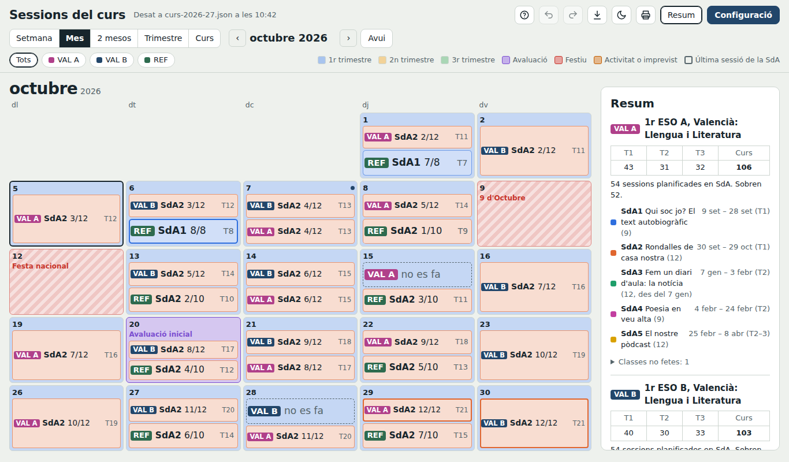

# Sessions del curs

Planificador de sessions i situacions d'aprenentatge (SdA) per a docents de secundària. És **un sol fitxer HTML** que s'obri amb el navegador: no s'ha d'instal·lar res, no cal crear cap compte i les dades es guarden en un fitxer `.json` que és teu.

## Per a què serveix

Quan planifiques una SdA en un full de càlcul i numeres les sessions a mà, n'hi ha prou que un dia no es faça classe (una eixida, una alerta meteorològica, un festiu que no tenies en compte) perquè hages de renumerar-ho tot. Aquesta eina ho fa sola:

- Indiques l'horari de cada grup (quantes sessions tens cada dia de la setmana) i les SdA amb el nombre de sessions.
- El calendari numera cada sessió: **SdA, número de sessió dins de la SdA i número dins del trimestre**.
- Si un dia no es fa classe, el marques i **totes les sessions posteriors es corren**.
- En tot moment saps quan acabarà cada SdA i si et sobren o et falten sessions.

## Funcionalitats

- **Grups i programacions compartides**: diversos grups del mateix nivell (1ESO A, B, C…) poden seguir les mateixes SdA; cada grup avança amb el seu horari.
- **Horari del centre**: defineixes les franges de classe (8:00–8:55…) i en cada grup tries la franja d'un desplegable.
- **Contingut de cada sessió** dins de la SdA, que es veu a la vista setmanal.
- **SdA amb data mínima d'inici** ("no abans del 7 de gener").
- **Dies sense classe**: festius (no compten com a classes perdudes) i activitats o imprevistos del centre (sí que compten). També es pot anul·lar la classe d'un sol grup.
- **Avaluacions** marcades al calendari.
- **Vistes**: setmana, mes, dos mesos, trimestre i curs sencer, amb filtre per grups.
- **Resum**: sessions per trimestre, dates d'inici i final de cada SdA, sessions que sobren o falten i classes no fetes per motiu.
- **Exportacions**: temporalització en full de càlcul (`.csv`) i calendari (`.ics` o `.csv` per a Google Calendar).
- **Impressió** amb fons blanc, amb o sense resum.
- **Desfer i refer** (Ctrl+Z / Ctrl+Y) i **còpies de seguretat** automàtiques dins del mateix fitxer.
- **Curs nou** en un pas: copia grups i SdA i deixa enrere anul·lacions, notes i avaluacions.
- **Visita guiada** interactiva (botó **?**) amb un planificador d'exemple.
- Mode clar i fosc.

## Com començar

### Opció A: en línia

Obri **https://USUARI.github.io/sessions-curs/** (canvia `USUARI` pel nom del compte de GitHub on està publicat). La pàgina s'executa al teu navegador; les dades continuen en el teu ordinador.

### Opció B: descarregant-la

1. Descarrega [`index.html`](index.html) (o tot el repositori: botó **Code → Download ZIP**).
2. Obri'l amb **Chrome o Edge** d'ordinador.
3. Polsa **«Crea un fitxer nou»** i guarda'l on vulgues. A partir d'ací, cada canvi s'hi desa sol.
4. Si vols veure-la funcionant abans de començar, polsa **«Fes la visita guiada»** o obri el fitxer d'exemple [`exemple/exemple-1eso-2026-27.json`](exemple/exemple-1eso-2026-27.json): dos grups de Valencià de 1r d'ESO (3 sessions setmanals) que comparteixen SdA i un grup del Taller de Reforç (2 sessions).

El [manual d'ús](docs/MANUAL.md) explica cada part amb captures, i hi ha una [presentació](docs/presentacio.pdf) per a explicar-la al departament (també en [PowerPoint](docs/presentacio.pptx), per a editar-la).

## On es guarden les dades

Tot queda en el fitxer `.json` que tries. La pàgina no envia res a cap servidor.

- **Chrome i Edge d'ordinador**: la pàgina escriu directament en el fitxer i recorda quin era. Si en el missatge de permís tries «Permet en cada visita», la pròxima vegada s'obrirà sol.
- **Firefox, Safari i mòbils**: no permeten escriure en fitxers. Carregues el `.json` en obrir la pàgina i el descarregues quan acabes.

### Treballar en equip

Si poses el `.json` en una carpeta d'**OneDrive o Google Drive sincronitzada** amb l'ordinador, el tens en tots els teus ordinadors i el pots compartir amb el departament.

- El més segur és **un fitxer per docent** dins de la carpeta compartida.
- Si diverses persones fan servir **el mateix fitxer**, la pàgina comprova abans de desar si algú l'ha canviat. En eixe cas no sobreescriu res i pregunta quina versió es queda. Funciona bé per a un ús normal, però no per a editar alhora de manera intensiva.

## Calendari escolar

Per al curs **2026-27** porta les dates oficials de la Comunitat Valenciana (inici, final, festius autonòmics, Nadal i Pasqua). Per a altres cursos calcula unes dates **aproximades** que cal revisar amb el calendari de Conselleria. Els festius locals i les vacances del centre els afig cada docent.

## Format del fitxer `.json`

| Camp | Contingut |
|---|---|
| `start`, `end` | Primer i últim dia lectiu (`AAAA-MM-DD`) |
| `terms` | Trimestres: `name`, `start`, `end`, `color` |
| `off` | Dies sense classe: `from`, `to`, `label`, `kind` (`fest` festiu, `inc` activitat o imprevist) |
| `evals` | Dies d'avaluació: `{ "AAAA-MM-DD": "nom" }` |
| `plans` | Programacions (conjunts de SdA que poden compartir diversos grups): `id`, `name` |
| `groups` | Grups: `id`, `code`, `name`, `color`, `plan`, `days` (sessions de dilluns a divendres), `times` (hora d'inici de cada dia) |
| `sdas` | SdA en ordre: `id`, `pid` (programació), `name`, `n` (sessions), `color`, `ses` (contingut de cada sessió), `after` (data mínima d'inici) |
| `ov` | Canvis d'un dia per a un grup: `{ "idGrup__AAAA-MM-DD": { "n": sessions, "note": "motiu" } }` |
| `notes` | Notes per dia |
| `slots` | Franges horàries del centre: `s` (inici), `e` (final) |
| `dur` | Durada de la sessió en minuts (si no hi ha franges) |
| `backups` | Últimes còpies de seguretat |

Els fitxers de versions anteriors s'obrin sense problemes: els camps que falten s'omplin amb valors per defecte.

## Contribuir

Les propostes són benvingudes:

- **Errors i idees**: obri una *issue* explicant què has fet, què esperaves i què ha passat. Una captura ajuda molt.
- **Canvis al codi**: fes un *fork*, treballa en una branca i obri una *pull request*.

Com està fet:

- Tot està en `index.html`: CSS, HTML i JavaScript sense dependències ni compilació. Per a provar un canvi, n'hi ha prou d'obrir el fitxer al navegador.
- El codi està dividit en seccions comentades (`càlcul`, `render del calendari`, `desat`, `configuració`, `visita guiada`…).
- La interfície està en valencià.
- Abans d'enviar canvis, comprova que s'obri el fitxer d'exemple i que la visita guiada arribe al final.
- En contribuir, acceptes que la teua aportació es publique amb la mateixa llicència GPL.

## Llicència

Copyright © 2026 Rubén Parra Savall.

Aquest programa és programari lliure, publicat amb la [Llicència Pública General de GNU, versió 3 o posterior](LICENSE) (GPL-3.0-or-later). El pots fer servir, estudiar, modificar i compartir lliurement. Si en distribueixes una versió modificada, també ha de ser lliure i amb la mateixa llicència, de manera que les millores sempre queden a l'abast de tothom.
