# Manual d'ús

Aquest manual recorre la pàgina de dalt a baix. Si prefereixes aprendre fent, polsa el botó **?** de dalt a la dreta: la **visita guiada** et porta pas a pas amb un planificador d'exemple, sense tocar el teu fitxer.

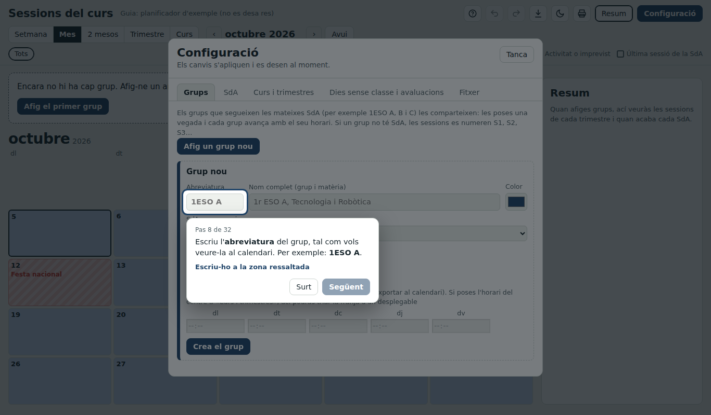

## 1. Primer ús

En obrir la pàgina per primera vegada apareix una barra amb tres opcions:

- **Crea un fitxer nou**: tries on es guarda el `.json`. A partir d'ací, cada canvi s'hi desa sol.
- **Obri un fitxer**: per a continuar amb un fitxer que ja tens.
- **Fes la visita guiada**.

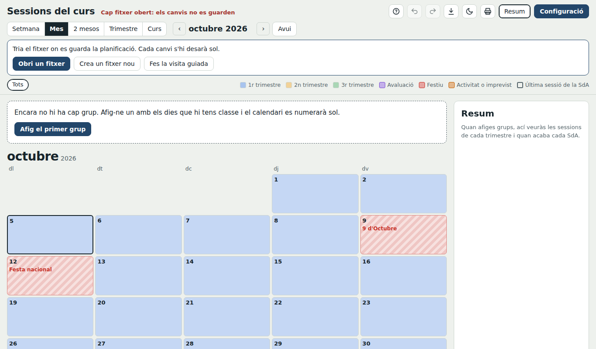

Dalt de tot, al costat del títol, sempre veus on s'està desant i a quina hora s'ha desat per última vegada. Si apareix en roig, el que fas no s'està guardant.

> Amb Firefox, Safari o el mòbil, la pàgina no pot escriure directament en el fitxer: el carregues en obrir-la i el descarregues quan acabes.

## 2. Curs i trimestres

**Configuració → Curs i trimestres**

- **Dates del curs**: polsa-les i tria el primer dia i l'últim al calendari.
- **Durada de cada sessió**: només s'usa en exportar al calendari si no has posat l'horari del centre.
- **Trimestres**: color, nom i dates. El color és el fons dels dies al calendari.
- **Comença un curs nou…**: mira l'apartat 11.

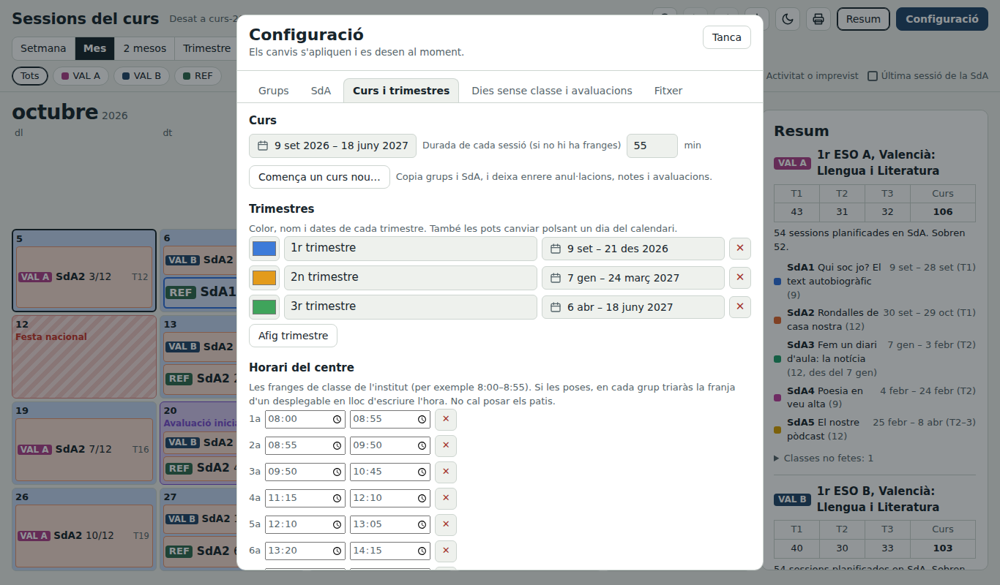

### Horari del centre

Més avall, a la mateixa pestanya, pots posar les **franges de classe** de l'institut (8:00–8:55, 8:55–9:50…). No cal posar els patis. Si les poses:

- En cada grup, l'hora de cada dia es tria d'un **desplegable** en lloc d'escriure-la.
- La vista setmanal mostra l'interval complet (per exemple, 11:15–12:10).
- En exportar al calendari, una classe de dues sessions seguides acaba al final de la segona franja, encara que hi haja un pati enmig.

Si canvies l'inici d'una franja, els grups que la tenien triada s'actualitzen sols.

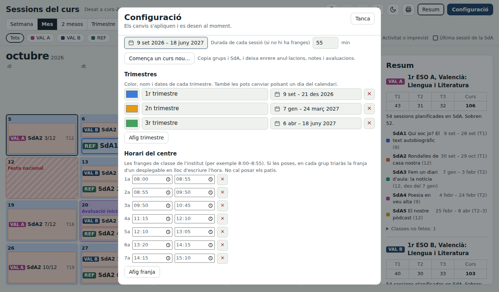

## 3. Grups

**Configuració → Grups → Afig un grup nou**

| Camp | Què hi poses |
|---|---|
| Abreviatura | Com es veurà al calendari: `VAL A`, `REF`… (obligatori i sense repetir) |
| Nom complet | Nivell, grup i matèria |
| Color | El de l'etiqueta del grup |
| SdA que segueix | **Programació nova** per a un grup amb SdA pròpies, o la d'un altre grup per a compartir-les |
| Sessions cada dia | Quantes sessions tens amb el grup cada dia de la setmana (almenys un dia) |
| Hora de la classe | Opcional: ordena la vista setmanal i s'usa en exportar al calendari. Si has posat l'horari del centre, es tria d'un desplegable. Els dies sense classe queden en gris |

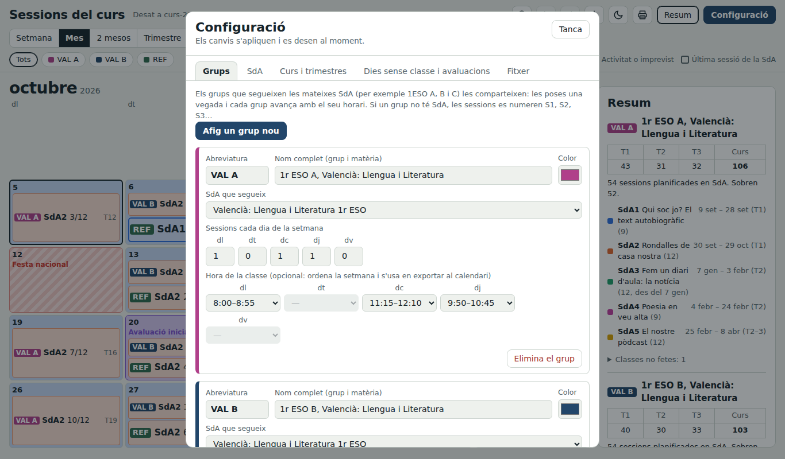

**Grups del mateix nivell.** Si 1ESO A, B i C fan les mateixes SdA, tria la mateixa programació en tots tres (a l'exemple, VAL A i VAL B comparteixen les SdA de Valencià). Les SdA es defineixen una sola vegada i cada grup avança al seu ritme segons el seu horari.

## 4. Situacions d'aprenentatge

**Configuració → SdA**

1. Tria la programació (dalt del tot es veu quins grups la fan).
2. **Afig SdA** i posa-li títol i nombre de sessions.
3. Les fletxes ↑ ↓ canvien l'ordre: les SdA es fan una darrere l'altra.
4. **Comença no abans de**: opcional. Si una SdA ha de començar en una data concreta (per exemple, el segon trimestre), les classes que queden entremig apareixen com a sessions lliures (S1, S2…).
5. **Contingut de les sessions**: què fas a cada sessió. Es veu a la vista setmanal.

Al costat de cada SdA es veu quan comença i quan acaba per a cada grup.

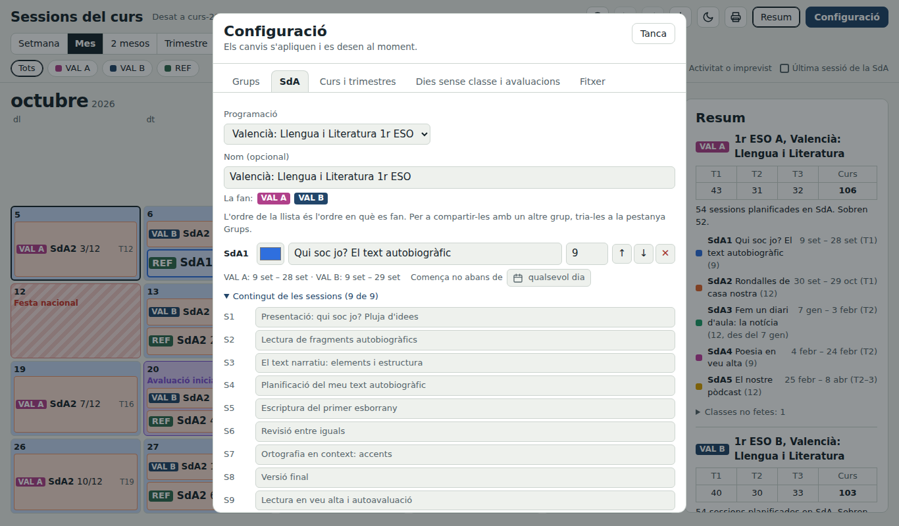

Si un grup no té SdA, les sessions es numeren S1, S2, S3… al llarg del curs.

## 5. Dies sense classe i avaluacions

**Configuració → Dies sense classe i avaluacions**

- **Festius**: autonòmics, Falles, festes locals, vacances. Es pinten en **roig** i no compten com a classes no fetes.
- **Activitats o imprevistos del centre**: una eixida de tot el centre, una alerta meteorològica. Es pinten en **taronja** i sí que compten com a classes no fetes.
- **Dies d'avaluació**: es pinten en **violeta** i no lleven classes.

Per a un període (Nadal, Pasqua), polsa el primer dia i l'últim al calendari.

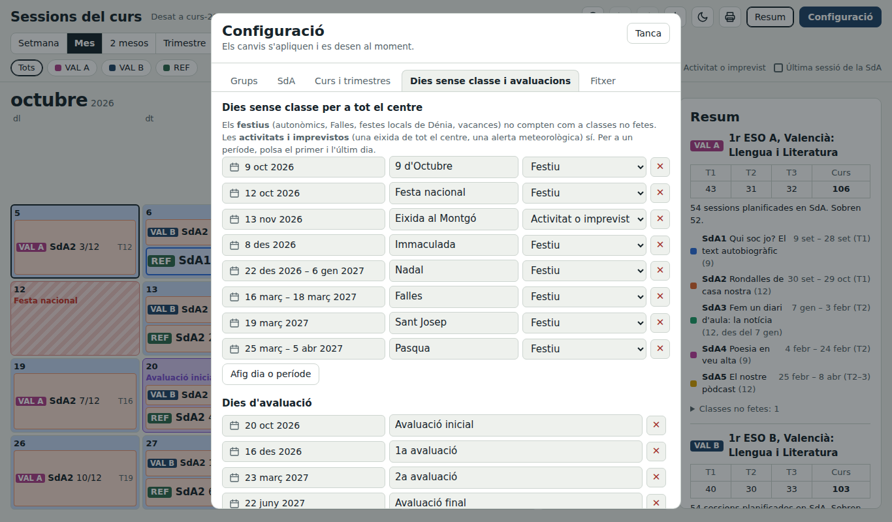

## 6. Llegir el calendari

Cada etiqueta és una sessió d'un grup:

- **`VAL A  SdA2 3/12  T12`**: grup, SdA, sessió 3 de 12 i sessió 12 del trimestre.
- **`S12`**: sessió del curs que no correspon a cap SdA.
- **Vora gruixuda**: última sessió de la SdA.
- **«no es fa»** amb la vora de punts: classe anul·lada.
- **Punt blau** al costat del número del dia: hi ha una nota.

Colors de fons: el del trimestre, **roig** per als festius, **taronja** per a activitats o imprevistos i **violeta** per a les avaluacions.

## 7. Canviar un dia

Polsa qualsevol dia del calendari.

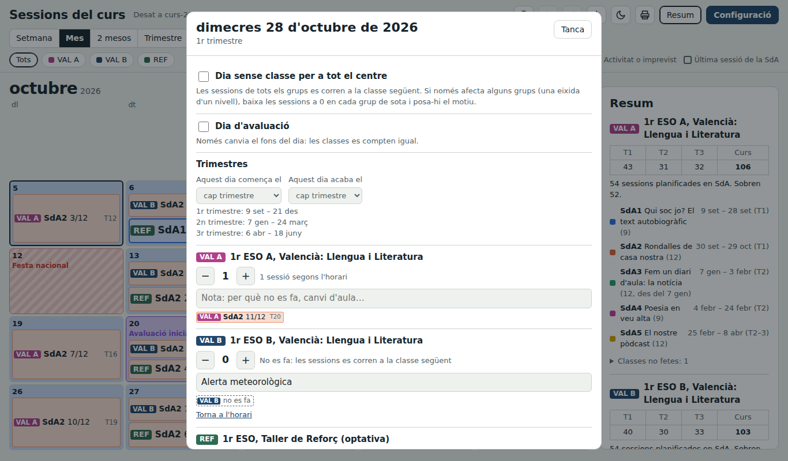

- **Una classe no es fa**: baixa les sessions d'aquell grup a 0 amb el botó **−** i escriu el motiu. Totes les sessions següents es corren.
- **Una classe extra**: puja les sessions amb **+**, també en un dia que no tens classe.
- **No hi ha classe per a tot el centre**: marca «Dia sense classe per a tot el centre» i tria si és festiu o activitat/imprevist.
- **Dia d'avaluació**, **inici o final de trimestre** i **nota del dia** també es canvien ací.
- **Torna a l'horari** desfà els canvis del grup en aquell dia.

## 8. Vistes

- **Setmana**: cada classe amb l'horari, la SdA, el contingut de la sessió i les notes.
- **Mes** i **2 mesos**: per a planificar.
- **Trimestre**: tots els mesos del trimestre en pantalla.
- **Curs**: tot el curs d'un colp d'ull, amb un quadret per sessió.

Les fletxes ‹ › (o les del teclat) avancen i retrocedeixen; **Avui** torna a la data actual.

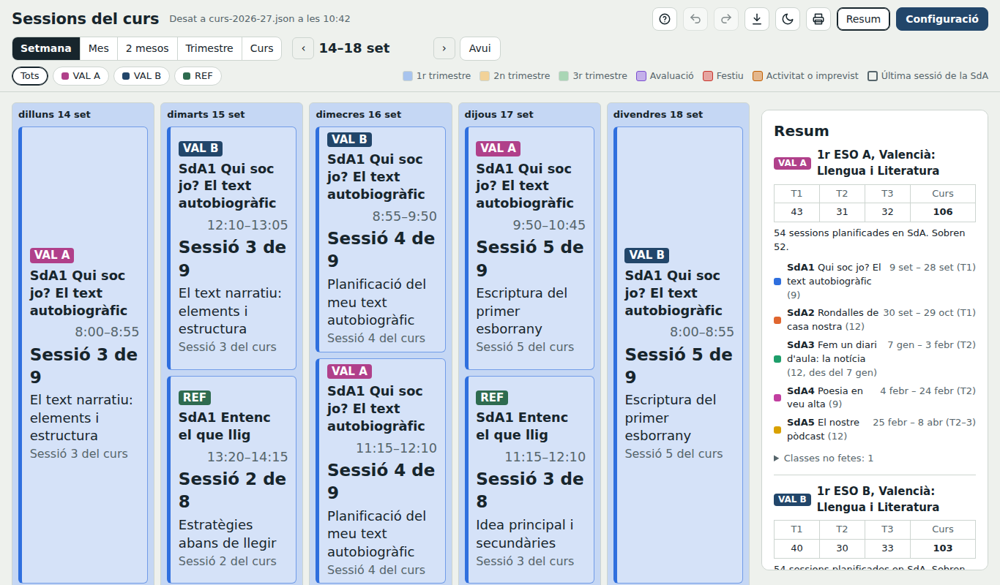
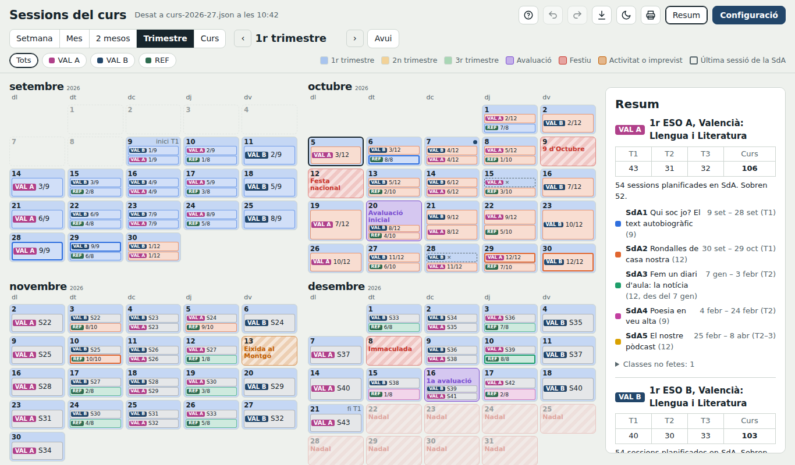
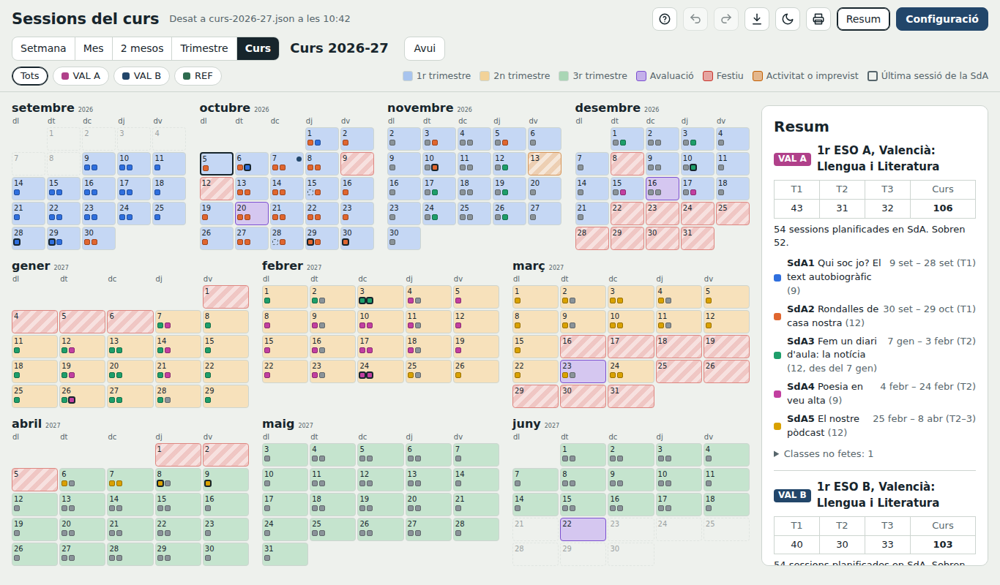

## 9. Filtres i resum

Els botons dels grups filtren el calendari i el resum. Se'n poden activar diversos alhora; **Tots** els torna a mostrar tots.

El **resum** mostra, per a cada grup:

- Sessions de cada trimestre i del curs.
- Sessions planificades en SdA i si en sobren o en falten.
- Inici i final de cada SdA (en roig si no hi cap dins del curs).
- **Classes no fetes**, separades entre les anul·lades en el grup i les activitats o imprevistos del centre, amb el motiu.

El botó **Resum** l'amaga per a guanyar espai.

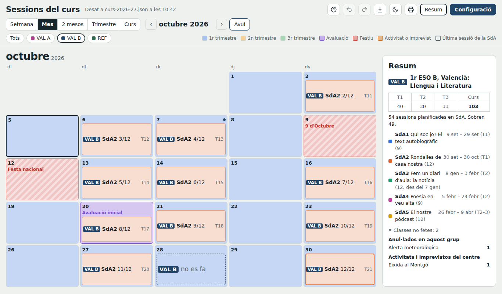

## 10. Exportar i imprimir

Amb la icona de **descàrrega**:

- **Temporalització (.csv)**: inici, final i sessions per trimestre de cada SdA, i els totals de cada grup. S'obri amb Excel o Google Sheets.
- **Calendari**: l'inici i el final de cada SdA o cada classe amb el seu contingut, en `.ics` (Google Calendar, Outlook, Apple) o en `.csv` per a Google Calendar. Convé importar-lo en un calendari a banda per a poder esborrar-lo de colp.

Amb la icona de la **impressora** tries la vista i si vols incloure el resum. Sempre s'imprimeix amb fons blanc i en horitzontal.

Les exportacions respecten el filtre de grups.

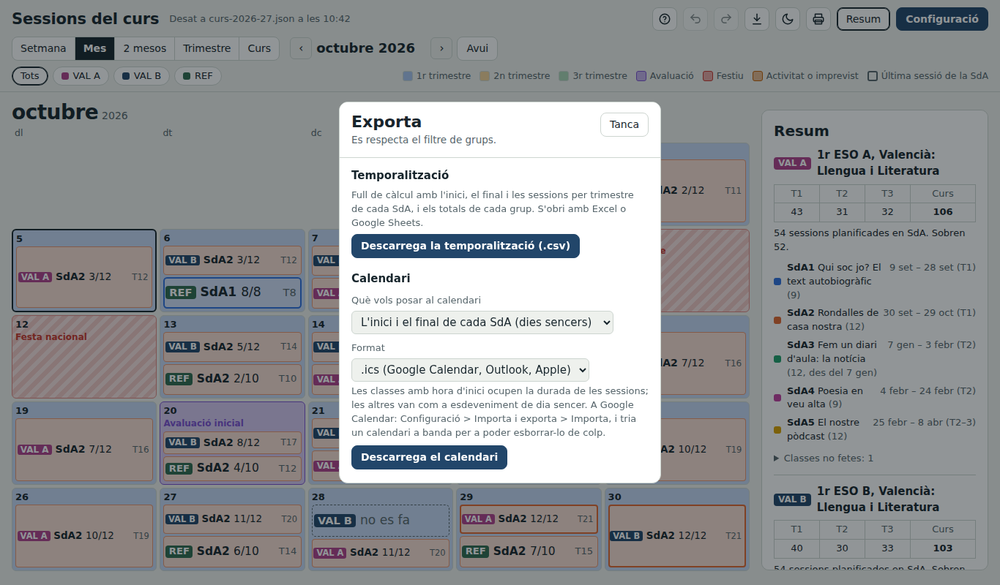

## 11. Fitxer, còpies i curs nou

**Configuració → Fitxer**

- **Còpies de seguretat**: dins del mateix `.json` es guarden les 6 últimes còpies automàtiques (una per dia de treball) i les que faces a mà. **Recupera** torna a qualsevol d'elles; també es pot desfer.
- **Desfer i refer**: botons de dalt o Ctrl+Z i Ctrl+Y.
- **Curs nou** (des de *Curs i trimestres*): copia els grups, les SdA i els festius sumant un any, i deixa enrere anul·lacions, notes i avaluacions. El curs anterior queda intacte en el seu fitxer.

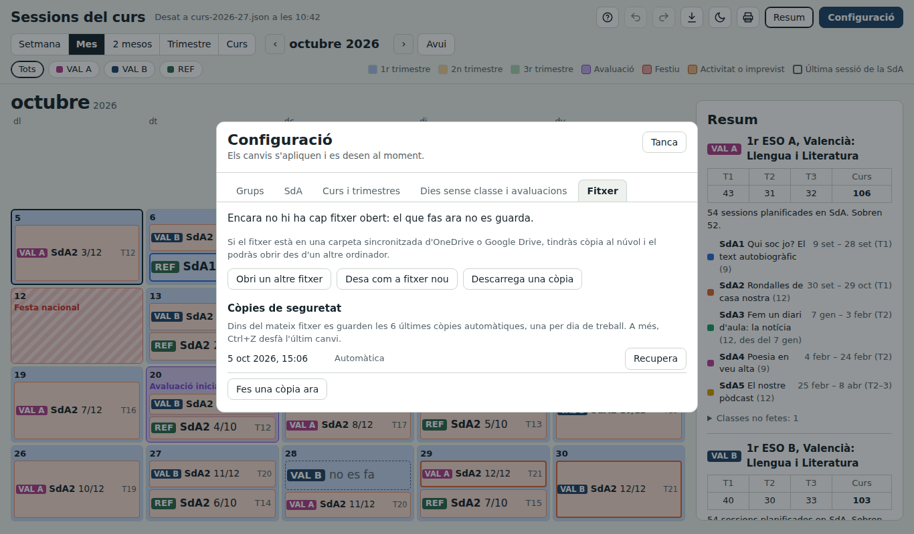

## 12. Dreceres de teclat

| Tecla | Acció |
|---|---|
| ← → | Període anterior o següent |
| Ctrl+Z | Desfer |
| Ctrl+Y o Ctrl+Maj+Z | Refer |
| Esc | Tancar diàlegs i el selector de dates |

## Preguntes freqüents

**Puc fer-la servir amb el mòbil?**
Sí, però el mòbil no pot escriure en el fitxer: carregues el `.json` i el descarregues quan acabes.

**Puc compartir el fitxer amb el departament?**
Sí. Posa'l en una carpeta d'OneDrive o Google Drive sincronitzada. El més segur és un fitxer per docent. Si diverses persones editen el mateix fitxer, la pàgina detecta els canvis dels altres i, si coincidiu, pregunta quina versió es queda.

**He obert el fitxer i no s'ha desat res.**
Mira el missatge de dalt: si està en roig, no hi ha cap fitxer obert. Polsa «Continua amb…» o «Obri un fitxer».

**Les dates del calendari escolar no són les del meu curs.**
Per al 2026-27 són les oficials. Per a altres cursos són aproximades: revisa-les a *Curs i trimestres* i *Dies sense classe*.
